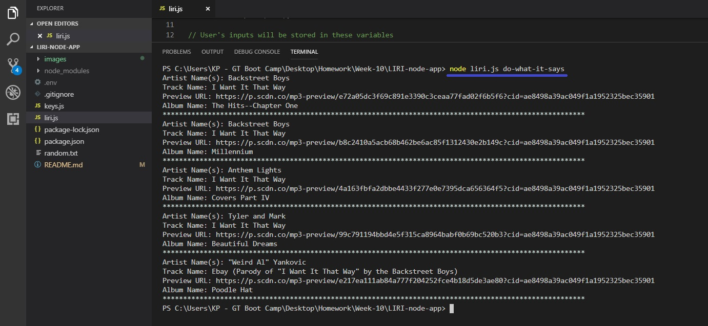

# LIRI

## Introduction
For this assignment, I built a command line node application called "LIRI".  LIRI is a _Language_ Interpretation and Recognition Interface that takes in parameters and give you back data.  LIRI is programmed to provide you with information for concerts, songs, and movies.

## How to use LIRI
Type "**node liri.js**" in your command line and press **Enter** to see how to utililze the four command lines below:

   * `concert-this`

   * `spotify-this-song`

   * `movie-this`

   * `do-what-it-says`

## See what each command line does

### Concert-this
This function will take the artist's or band's name that you enter and will then return their concert information from the Bands in Town API.

### Spotify-this-song
This function will take the name of the song you entered and will then return the song information from Spotify's API.

### Movie-this
This function will take the movie's title name will then return the information for that movie from OMDb's API.

### Do-what-it-says
This function will use the built-in `fs` Node package to get the text from the **random.txt** file and will then use it to call the appropriate command from LIRI.

