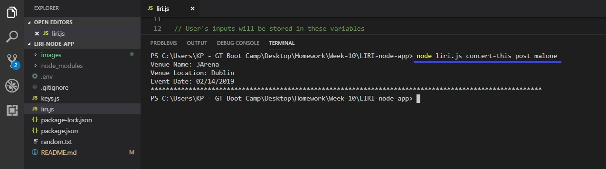
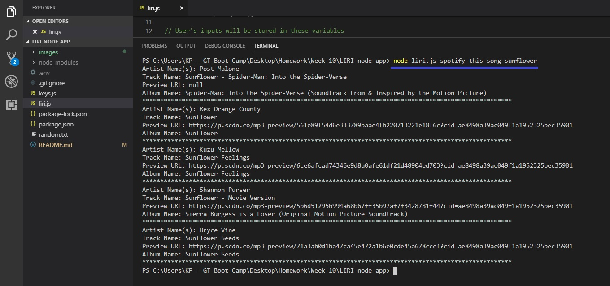
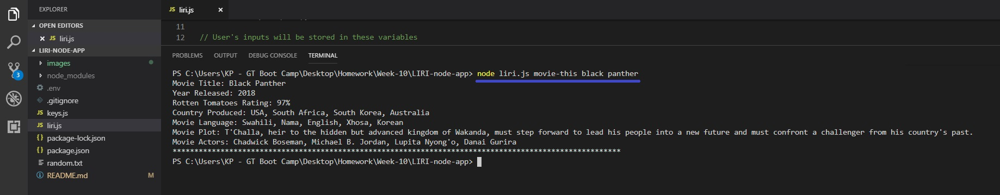

# LIRI

### Introduction
For this assignment, I built a command line node application called "LIRI".  LIRI is a _Language_ Interpretation and Recognition Interface that takes in parameters and give you back data.  LIRI is programmed to provide you with information for concerts, songs, and movies.

### How to use LIRI
Type "**node liri.js**" in your command line and press enter for further instructions, or just follow the instructions and screen shots provided below.

### Find a Concert
This function will take the artist's or band's name that you enter and will then return their concert information from the Bands in Town API.

### Find Song Information
This function will take the name of the song you entered and will then return the song information from Spotify's API.

### Find Movie Information
This function will take the movie's title name will then return the information for that movie from OMDb's API.

