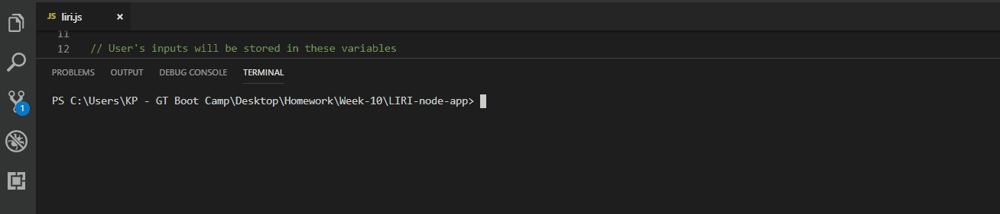

# LIRI

## Introduction
For this assignment, I built a command line node application called "LIRI".  LIRI is a _Language_ Interpretation and Recognition Interface that takes in parameters and give you back data.  LIRI is programmed to provide you with information for concerts, songs, and movies.

## How to use LIRI
Type "**node liri.js**" in your command line and press **Enter** to see how to utililze the four command lines below:

   * `concert-this`

   * `spotify-this-song`

   * `movie-this`

   * `do-what-it-says`

## Watch what each command line does

### * `concert-this`

This function allows the user to enter their favorite artist's or band's name and will then provide their concert information from the Bands in Town API.

### Spotify-this-song
This function gives the user the option of entering the name of a song and will then show that song's information from Spotify's API.  The application will display up to five results from a single search.

### Movie-this
This function will take the movie's title name and will then return the information for that movie from OMDb's API.

### Do-what-it-says
This function uses the built-in `fs` Node package to capture the text from the **random.txt** file and will then use that text to call the appropriate command from LIRI.  Any of the three commands above can be entered into the **random.txt** file at a single time.

